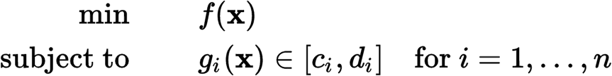

DEPSO
========

DEPSO, or called DEPS, is an algorithm hybridizing the advantages of Particle Swarm Optimization (PSO) and Differential Evolution (DE). It solves (constrained) numerical optimization problem (NOP) as

where f(x) is the objective function and each g(x) is a constraint function to be satisfied, and _c_ and _d_ are constants. All the functions can be nonlinear and nonsmooth.

General information
-------------------

Portal: http://www.wiomax.com/depso
E-MAIL: info@wiomax.com

Version History
-------------------

Current: The mini Series V1.00.03 (Java) with the DEPSO implementation

Quick start
-----------

- Execute: Enter the directory "myprojects", then run the file "examples.bat".

- Compile: Type "ant" to build, and the output file will be dist/depso.jar. 

- See src/problem for examples of constrain and unconstrained problem instances.

License description
-------------------

See the [Creative Commons Non-Commercial License 3.0](https://creativecommons.org/licenses/by-nc/3.0/us/) for more details.

Please acknowledge the author(s) if you use this code in any way.

